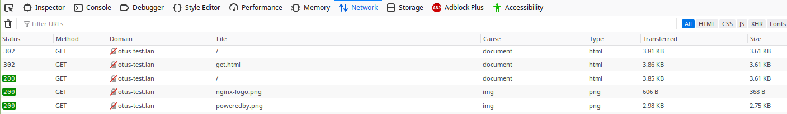

#  Web сервера

Простая защита от DDOS
Написать конфигурацию nginx, которая даёт доступ клиенту только с определенной cookie.
Если у клиента её нет, нужно выполнить редирект на location, в котором кука будет добавлена, после чего клиент будет обратно отправлен (редирект) на запрашиваемый ресурс.

Смысл: умные боты попадаются редко, тупые боты по редиректам с куками два раза не пойдут

Для выполнения ДЗ понадобятся
https://nginx.org/ru/docs/http/ngx_http_rewrite_module.html
https://nginx.org/ru/docs/http/ngx_http_headers_module.html


```
vagrant up
```

```
andreyr@andreyr-pc ~ curl otus-test.lan
<html>
<head><title>302 Found</title></head>
<body bgcolor="white">
<center><h1>302 Found</h1></center>
<hr><center>nginx/1.12.2</center>
</body>
</html>

andreyr@andreyr-pc ~ curl otus-test.lan --cookie "VAR=cookiemonsterlovescookies"
<!DOCTYPE html PUBLIC "-//W3C//DTD XHTML 1.1//EN" "http://www.w3.org/TR/xhtml11/DTD/xhtml11.dtd">

<html xmlns="http://www.w3.org/1999/xhtml" xml:lang="en">
    <head>
        <title>Test Page for the Nginx HTTP Server on Fedora</title>
        <meta http-equiv="Content-Type" content="text/html; charset=UTF-8" />
...
```
How it looks in browser<br>

