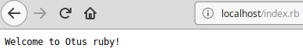
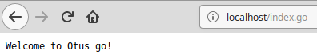
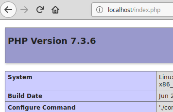

Instruction

nginx + php + go + ruby
```
docker-compose up -d
curl localhost
curl localhost/index.php
curl localhost/index.go
curl localhost/index.rb
docker-compose down
```
HTML<br>
<br>
Ruby<br>
<br>
Go<br>
<br>
PHP<br>
<br>
