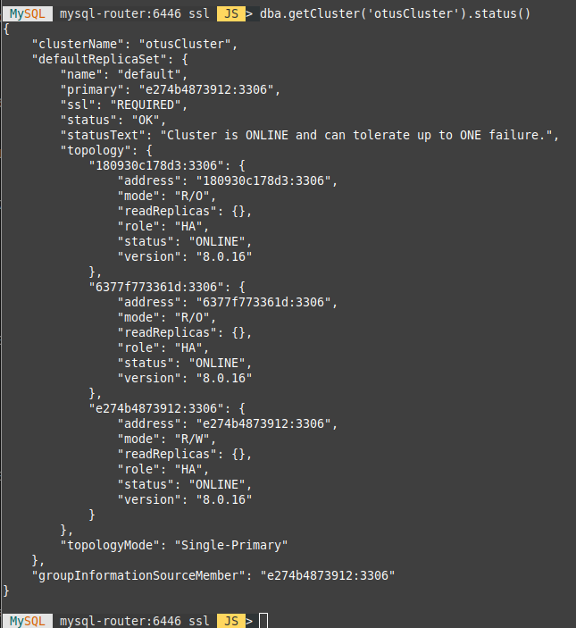

# mysql cluster

развернуть InnoDB кластер в docker

```
docker-compose up -d
```


```
 bytamine@bytamine-pc $ docker ps
CONTAINER ID        IMAGE                       COMMAND                  CREATED              STATUS                        PORTS                                                    NAMES
4a3c4d3725a4        mysql/mysql-router:8.0.16   "/run.sh mysqlrouter"    About a minute ago   Up 39 seconds (healthy)       6447/tcp, 64460/tcp, 0.0.0.0:6446->6446/tcp, 64470/tcp   mysql-router
8936251c5763        mysql/mysql-server:8.0.16   "/entrypoint.sh mysq…"   About a minute ago   Up About a minute (healthy)   33060/tcp, 0.0.0.0:3301->3306/tcp                        node1
3e491a205927        mysql/mysql-server:8.0.16   "/entrypoint.sh mysq…"   About a minute ago   Up About a minute (healthy)   33060/tcp, 0.0.0.0:3302->3306/tcp                        node2
2b7a3ace62d9        mysql/mysql-server:8.0.16   "/entrypoint.sh mysq…"   About a minute ago   Up About a minute (healthy)   33060/tcp, 0.0.0.0:3303->3306/tcp                        node3

```
```
 bytamine@bytamine-pc $ docker exec -ti mysql-router mysql -u otus -potus -e 'show databases;'
+--------------------+
| Database           |
+--------------------+
| information_schema |
| otus               |
+--------------------+
```

```
bash-4.2# mysqlsh
    MySQL Shell 8.0.16

MySQL  JS > shell.connect('root@mysql-router:6446', 'otus')
    Creating a session to 'root@mysql-router:6446'
    Fetching schema names for autocompletion... Press ^C to stop.
    Your MySQL connection id is 3622
    Server version: 8.0.16 MySQL Community Server - GPL
    No default schema selected; type \use <schema> to set one.
    <ClassicSession:root@mysql-router:6446>

 MySQL  mysql-router:6446 ssl  JS > dba.getCluster('otusCluster').status()
{
    "clusterName": "otusCluster",
    "defaultReplicaSet": {
        "name": "default",
        "primary": "e274b4873912:3306",
        "ssl": "REQUIRED",
        "status": "OK",
        "statusText": "Cluster is ONLINE and can tolerate up to ONE failure.",
        "topology": {
            "180930c178d3:3306": {
                "address": "180930c178d3:3306",
                "mode": "R/O",
                "readReplicas": {},
                "role": "HA",
                "status": "ONLINE",
                "version": "8.0.16"
            },
            "6377f773361d:3306": {
                "address": "6377f773361d:3306",
                "mode": "R/O",
                "readReplicas": {},
                "role": "HA",
                "status": "ONLINE",
                "version": "8.0.16"
            },
            "e274b4873912:3306": {
                "address": "e274b4873912:3306",
                "mode": "R/W",
                "readReplicas": {},
                "role": "HA",
                "status": "ONLINE",
                "version": "8.0.16"
            }
        },
        "topologyMode": "Single-Primary"
    },
    "groupInformationSourceMember": "e274b4873912:3306"
}
```

<br>

```
docker-compose down
```
