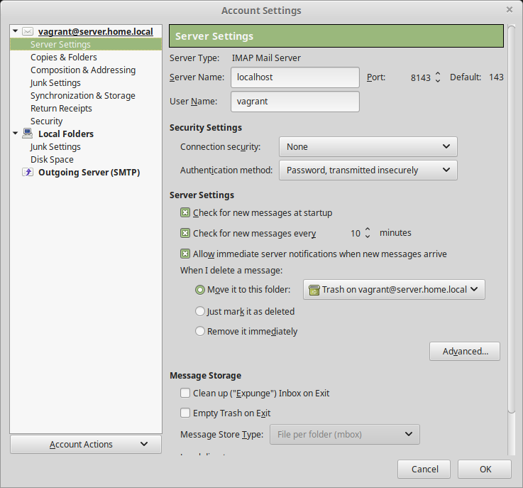
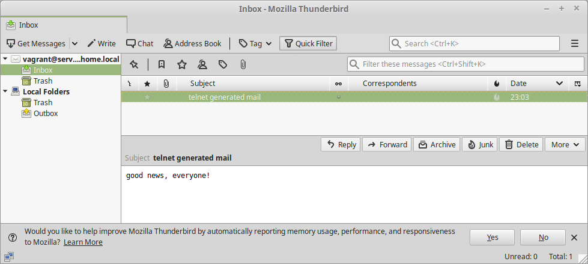

# установка почтового сервера

1. Установить в виртуалке postfix+dovecot для приёма почты на виртуальный домен любым обсужденным на семинаре способом
2. Отправить почту телнетом с хоста на виртуалку
3. Принять почту на хост почтовым клиентом

```
vagrant up
```

Sending email via telnet
```
 bytamine@bytamine-pc $ telnet localhost 8025
Trying 127.0.0.1...
Connected to localhost.
Escape character is '^]'.
ehlo server.otus.local
220 server.otus.local ESMTP Postfix
250-server.otus.local
250-PIPELINING
250-SIZE 10240000
250-VRFY
250-ETRN
250-ENHANCEDSTATUSCODES
250-8BITMIME
250 DSN
mail from: bytamine@otus.local
250 2.1.0 Ok
rcpt to: vagrant@server.otus.local
250 2.1.5 Ok
data
354 End data with <CR><LF>.<CR><LF>
Subject: telnet generated mail
good news, everyone!
.
250 2.0.0 Ok: queued as 4EDAD2000073
```

Checking email via telnet
```
 bytamine@bytamine-pc $ telnet localhost 8143
Trying 127.0.0.1...
Connected to localhost.
Escape character is '^]'.
* OK [CAPABILITY IMAP4rev1 LITERAL+ SASL-IR LOGIN-REFERRALS ID ENABLE IDLE AUTH=PLAIN] Dovecot ready.
a login vagrant password
a OK [CAPABILITY IMAP4rev1 LITERAL+ SASL-IR LOGIN-REFERRALS ID ENABLE IDLE SORT SORT=DISPLAY THREAD=REFERENCES THREAD=REFS THREAD=ORDEREDSUBJECT MULTIAPPEND URL-PARTIAL CATENATE UNSELECT CHILDREN NAMESPACE UIDPLUS LIST-EXTENDED I18NLEVEL=1 CONDSTORE QRESYNC ESEARCH ESORT SEARCHRES WITHIN CONTEXT=SEARCH LIST-STATUS BINARY MOVE SNIPPET=FUZZY SPECIAL-USE] Logged in
b select inbox
* FLAGS (\Answered \Flagged \Deleted \Seen \Draft)
* OK [PERMANENTFLAGS (\Answered \Flagged \Deleted \Seen \Draft \*)] Flags permitted.
* 1 EXISTS
* 1 RECENT
* OK [UNSEEN 1] First unseen.
* OK [UIDVALIDITY 1562702193] UIDs valid
* OK [UIDNEXT 2] Predicted next UID
b OK [READ-WRITE] Select completed (0.004 + 0.000 + 0.004 secs).

```

Thuderbird settings<br>
<br>

Mail in Thunderbird
<br>
